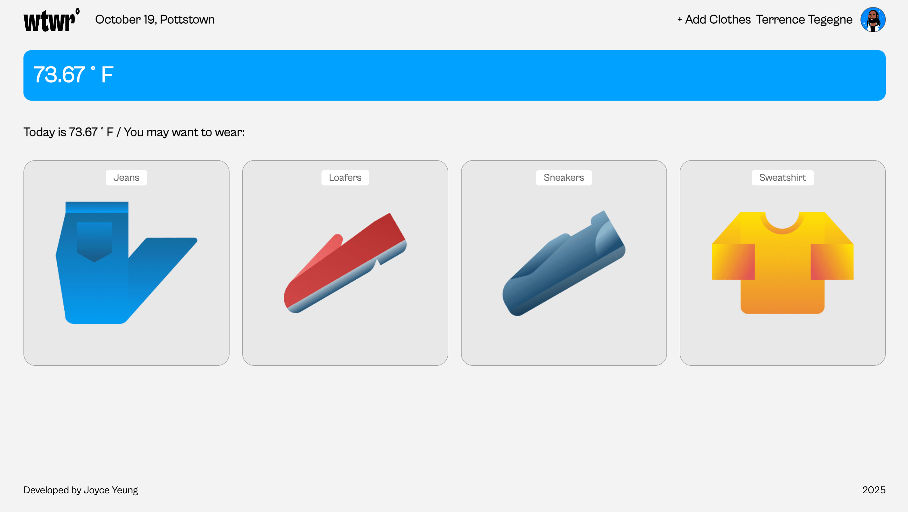
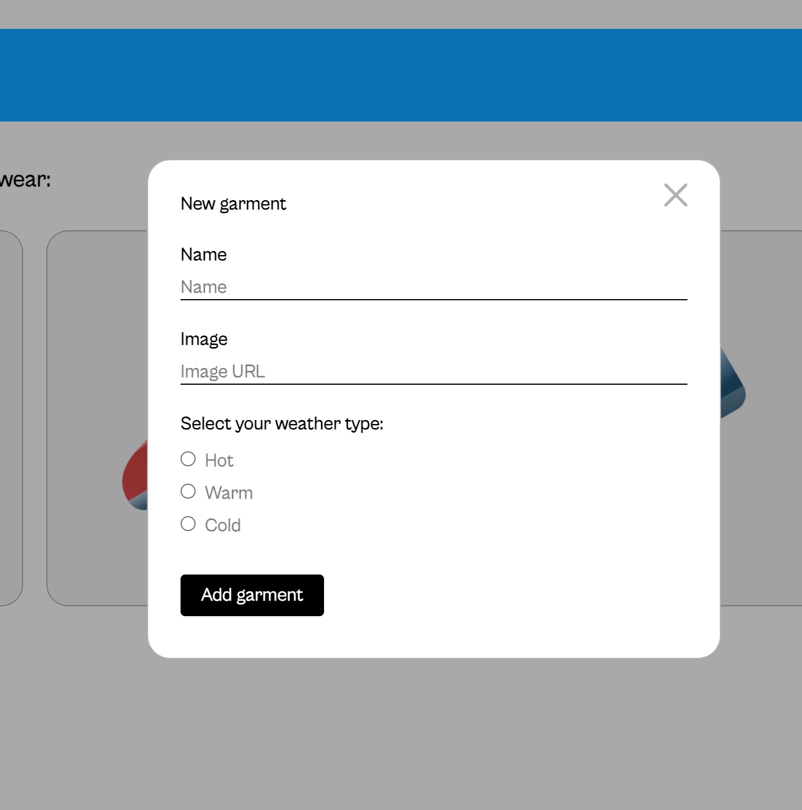
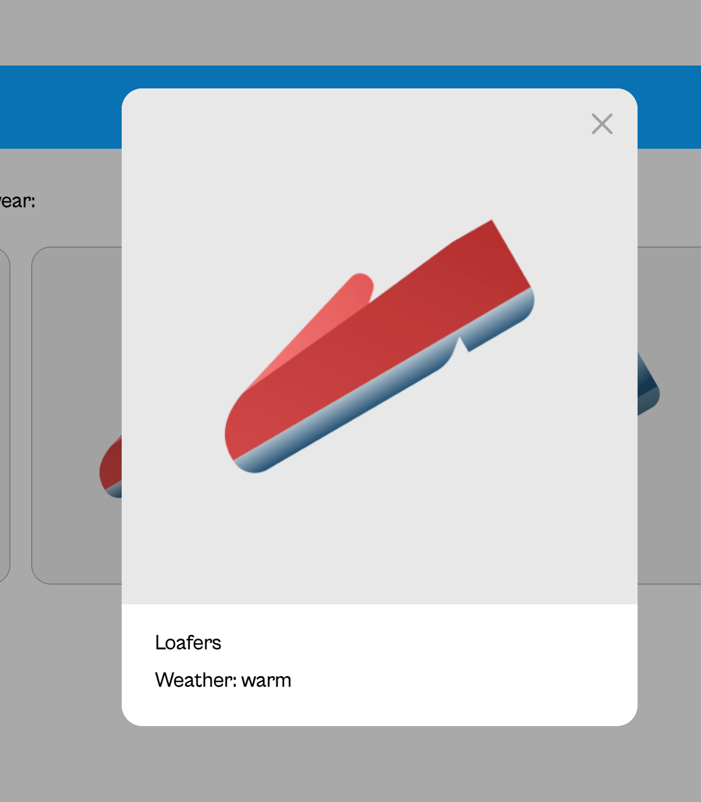
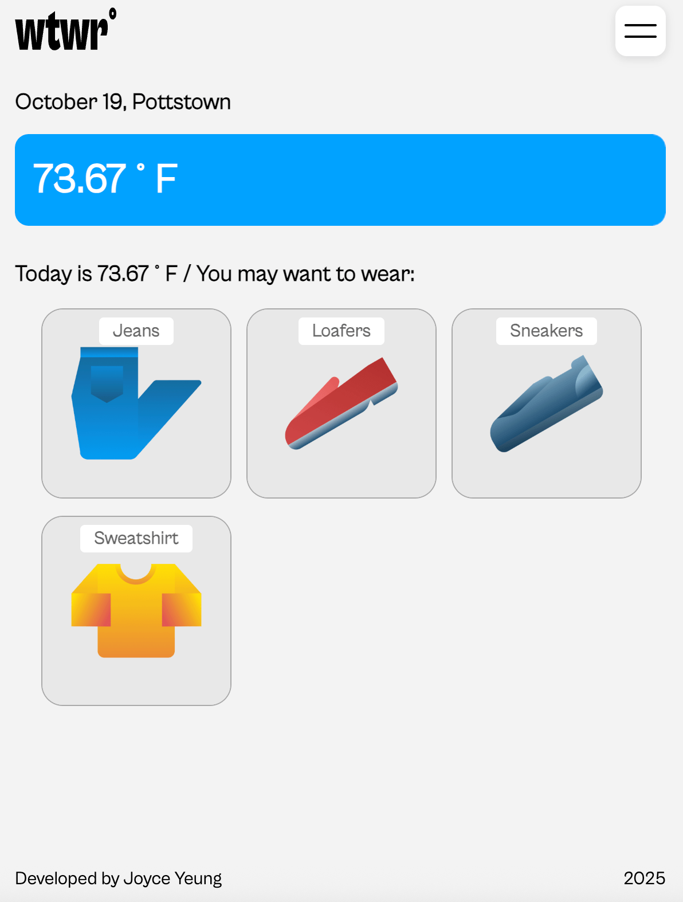
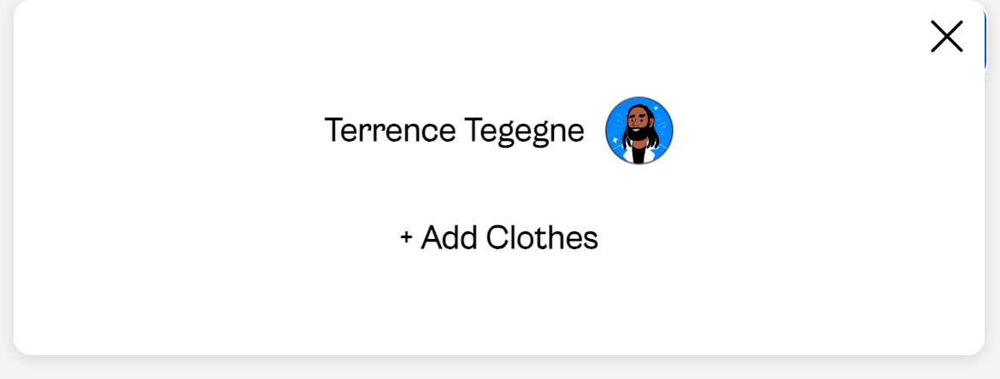
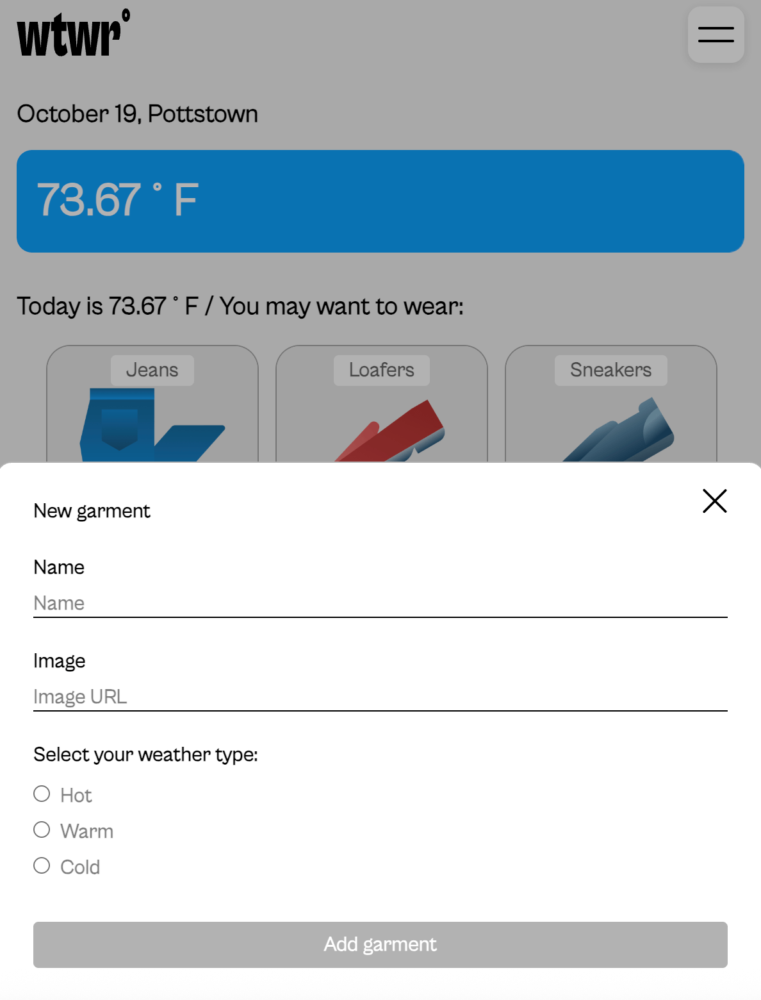
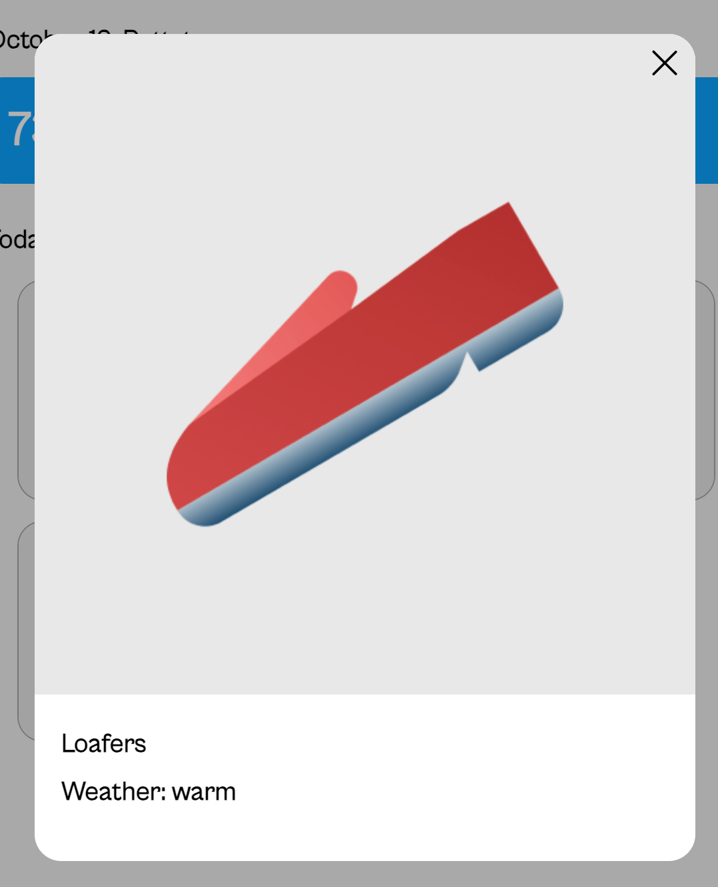

# Weather Wardrobe

Weather Wardrobe is a responsive React + Vite web application that recommends clothing items based on the current weather. The app dynamically displays temperature in °F, filters clothing items by weather type, and lets users view and add items through modals.

---

## Project Description

Weather Wardrobe simulates a smart clothing-recommendation experience. It combines live weather data with a personalized wardrobe interface.

Users can:

- View the current temperature and weather conditions (°F).
- See recommended clothing items filtered by weather type (hot, warm, cold).
- Open an item modal to preview an image and description.
- Add new items through the Add Clothes form modal.
- Navigate between desktop and mobile views with a responsive header and mobile menu toggle.

---

## Technologies & Techniques Used

- **React (Vite)**: component-based architecture and fast dev environment
- **HTML5 / JSX**: semantic structure and dynamic rendering
- **CSS3**: Styling, responsive layout, and transitions
- **JavaScript (ES6+)**: component logic, hooks, and state management
- **Weather API**: fetch live temperature and weather data
- **Flexbox & CSS Grid**: responsive layout control
- **Media Queries**: For responsiveness across devices
- **SVG icons / assets**: For scalable, sharp user interface icons
- **BEM Methodology**: Clean and modular CSS naming convention

---

## API Integration

The app connects to a weather API to fetch live weather data: `https://openweathermap.org/`

---

## Screenshots

### Desktop View

### Mobile View

## Design Prototype

This project was built based on a Figma design. You can view the original prototype here:
[View the Figma Design](https://www.figma.com/design/F03bTb81Pw8IDPj5Y9rc5i/Sprint-10-Project--WTWR?node-id=311-433&p=f&t=w5G5AnhDa0BVgXXM-0)

---

## Live Demo

You can view the deployed project here:  
[Weather Wardrobe on GitHub Pages]()

---

## Author

By **Joyce Yeung**
